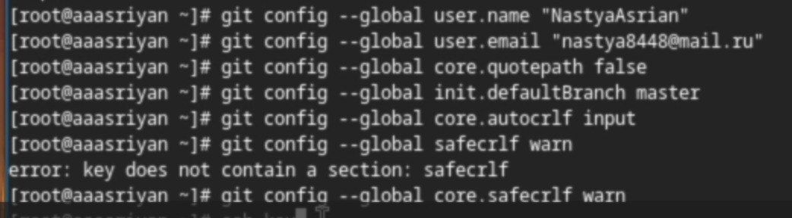
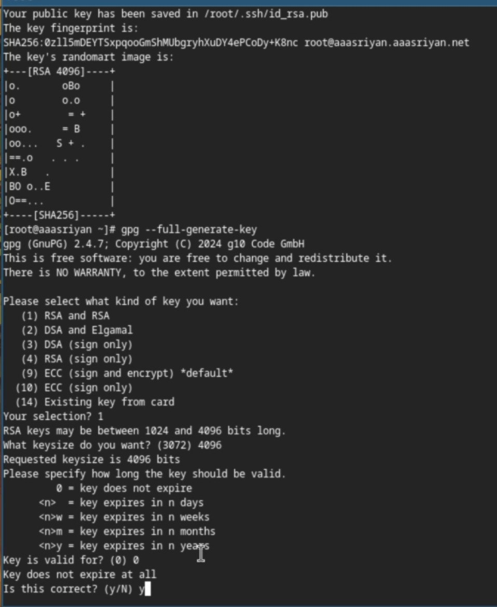
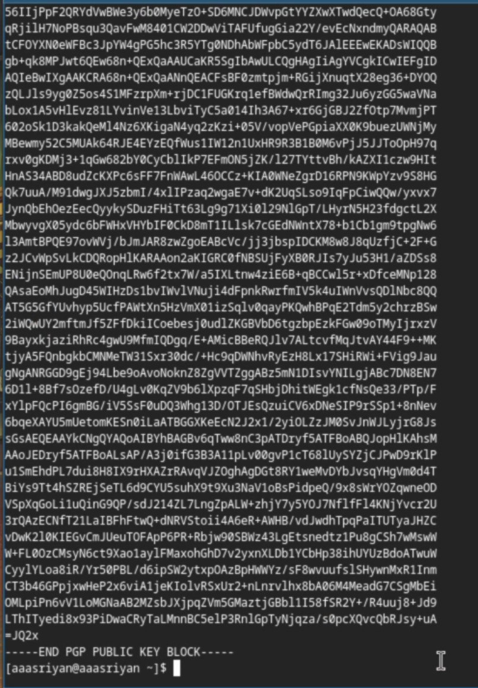
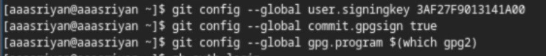
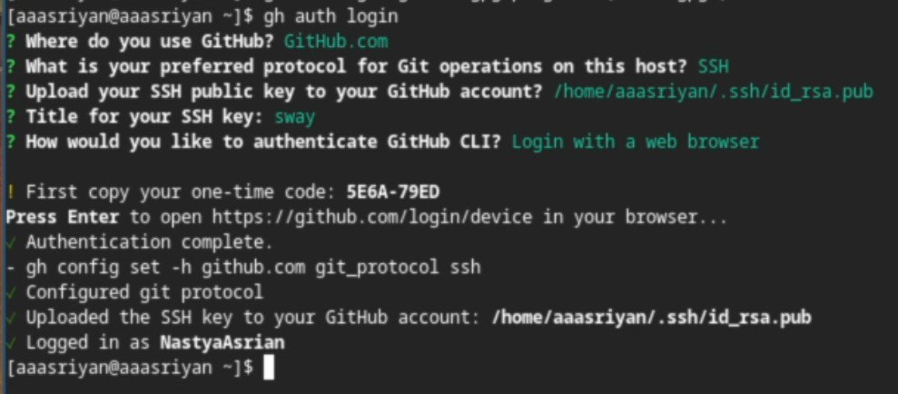
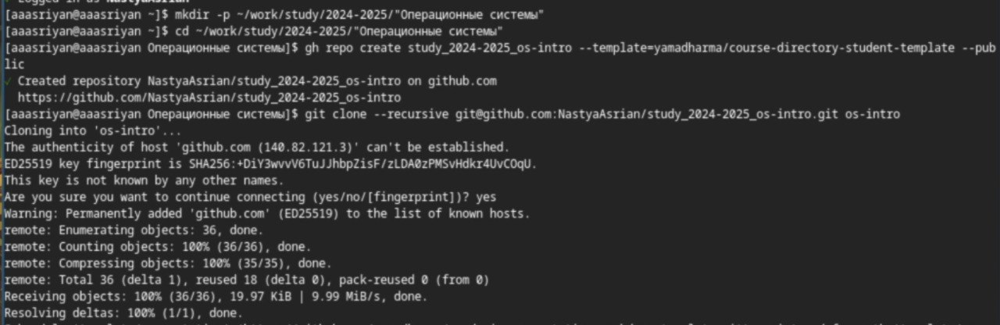
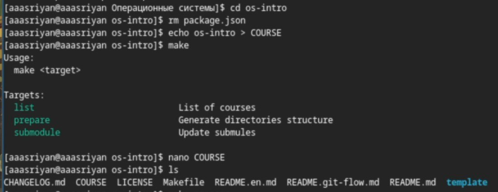
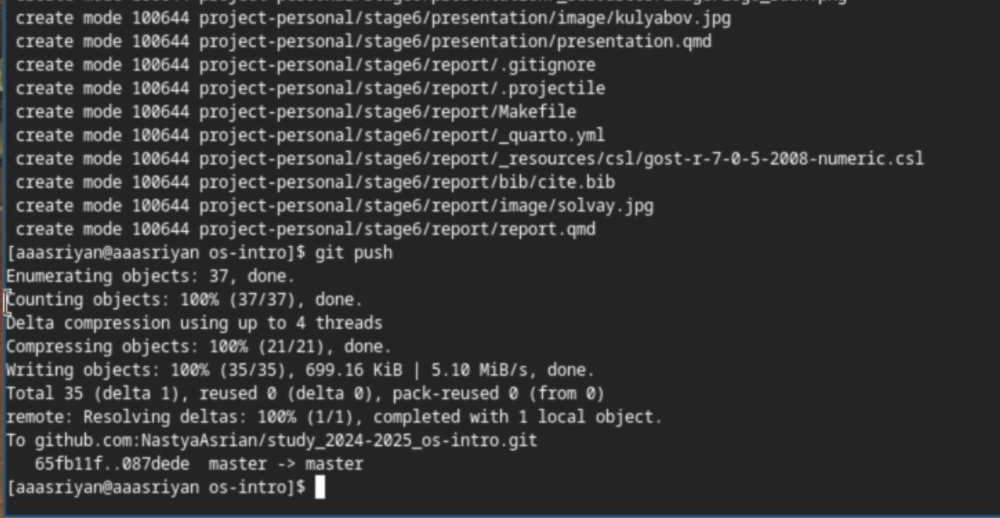

# Цель работы

Целью данной работы является изучение идеологии и применения средств
контроля версий и освоение умения по работе с git

# Задание

1.  Делаем базовую конфигурацию для работы с git
2.  Ключ SSH
3.  Ключ PGP
4.  Подписи для коммитов git
5.  Авторизариция на Github
6.  Локальный каталог для выполнения заданий по предмету

# Теоретическое введение

Системы контроля версий (Version Control System, VCS) применяются при
работе нескольких человек над одним проектом. Обычно основное дерево
проекта хранится в локальном или удалённом репозитории, к которому
настроен доступ для участников проекта. При внесении изменений в
содержание проекта система контроля версий позволяет их фиксировать,
совмещать изменения, произведённые разными участниками проекта,
производить откат к любой более ранней версии проекта, если это
требуется.

В классических системах контроля версий используется централизованная
модель, предполагающая наличие единого репозитория для хранения файлов.
Выполнение большинства функций по управлению версиями осуществляется
специальным сервером. Участник проекта (пользователь) перед началом
работы посредством определённых команд получает нужную ему версию
файлов. После внесения изменений, пользователь размещает новую версию в
хранилище. При этом предыдущие версии не удаляются из центрального
хранилища и к ним можно вернуться в любой момент. Сервер может сохранять
не полную версию изменённых файлов, а производить так называемую
дельта-компрессию --- сохранять только изменения между последовательными
версиями, что позволяет уменьшить объём хранимых данных.

# Выполнение лабораторной работы

Произвожу базовую настройку git. (рис. [-@fig:001])

{#fig:001}

Создаю ssh и gpg ключи. (рис. [-@fig:002])

{#fig:002}

Экспортирую gpg ключ для авторизации на girhub. (рис. [-@fig:003])

{#fig:003}

Настраиваем автоматические подписи для коммитов. (рис. [-@fig:004])

{#fig:004}

Авторизуюсь на github для работы через терминал. (рис. [-@fig:005])

{#fig:005}

Создаю директорию курса по шаблону. (рис. [-@fig:006])

{#fig:006}

Настраиваю рабочую директорию. (рис. [-@fig:007])

{#fig:007}

Отправка данных на удалённый репозиторий. (рис. [-@fig:008])

{#fig:008}

# Выводы

В результате выполнения данной работы я приобрела необходимые навыки
работы с базывыми командами системы контроля версий git, а также
приобрела практические навыки по работе с реализацией VCS git

# Список литературы {#список-литературы .unnumbered}
